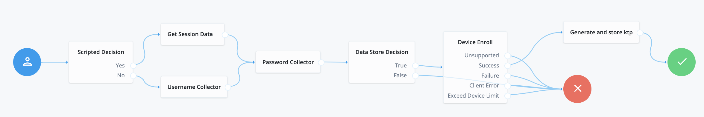
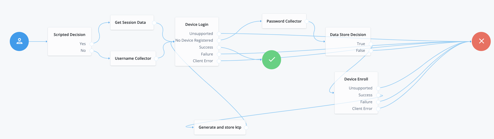
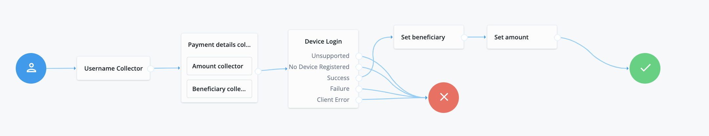

<!--
 # =====================================================================
# Midships Limited
# Copyright (c) 2023
# This file contains scripts/code owned by Midships Limited
#
# NOTE: Don't check this file into source control with any sensitive hard coded value.
#
# Legal Notice: Installation and use of this script is subject to
# a license agreement with Midships Limited (a company registered
# in England, under company registration number: 11324587).
# This script cannot be modified or shared with another organisation
# unless approved in writing by Midships Limited.
# You as a user of this script must review, accept and comply with the
# license terms of each downloaded/installed package that is referenced
# by this script. By proceeding with the installation, you are accepting
# the license terms of each package, and acknowledging that your use of
# each package will be subject to its respective license terms.
# =====================================================================
-->
#  Digital Transaction Signing Auth Trees

A set of authentication trees for ForgeRock's Identity Platform 7.0.0 and ForgeRock Identity Cloud which configures digital transaction signing for AM.
* **Website**: www.midships.io  
* **Email**: support@midships.io / sales@midships.io 

## Usage 

To deploy these trees in Identity Cloud, download the .json tree files from the releases tab on github 
[here](https://github.com/ForgeRock/). Next, import the .json files individually from  __Journeys -> Import__.

If you'd like to import the trees programatically in an on-premise or Identity Cloud deployment you can follow the instructions mentioned below for each journey using the
[AM-treetool](https://github.com/jonknightfr/AM-treetool) or the newest version, [Frodo](https://github.com/rockcarver/frodo). 

### Midships passwordless registration tree
This tree is used to enroll your device to your profile and store the public key information along with the device metadata that will later be used for passwordless login and doing digital transactions. As part of the device enrollment process, user will be prompted to introduce his password before the device gets enrolled in his profile. At the end of the device enrollment process, the tree will also generate a symmetric key secret (ktp) that can be used for the Midships caller verification trees.
The tree is composed by the following nodes:
* **Active session check** - Script which will check if user has provided existing session token.
* **Get Session data** - If user has submitted an existing session token, will retrieve the session details.
* **Username collector** - Collects username from user if unable to retrieve from provided session token.
* **Password collector** - Collects password from user as a second factor before enrolling the device.
* **Data Store Decision** - Validates username+password combination against the configured realm data store.
* **Device Enroll** - FIDO2 compliant node use to register the user device metadata along with the public key for passwordless. Only used if the user calling the tree has not enrolled his device as part of the passwordless registration tree. See more [here](https://backstage.forgerock.com/docs/auth-node-ref/latest/auth-node-webauthn-registration.html).
* **Generate and store ktp** - Will randomly generate a ktp secret under *frIndexedString1* user attribute. For on premise deployments, this can be changed to a custom attribute name in the associated node script.

### Midships passwordless login tree
The tree is composed by the following nodes:
* **Active session check** - Script which will check if user has provided existing session token.
* **Get Session data** - If user has submitted an existing session token, will retrieve the session details.
* **Username collector** - Collects username from user if unable to retrieve from provided session token.
* **Password collector** - Collects password from user as a second factor before enrolling the device if not enrolled yet.
* **Data Store Decision** - Validates username+password combination against the configured realm data store if device has not been enrolled yet.
* **Device Enroll** - FIDO2 compliant node use to register the user device metadata along with the public key for passwordless. Only used if the user calling the tree has not enrolled his device as part of the passwordless registration tree. See more [here](https://backstage.forgerock.com/docs/auth-node-ref/latest/auth-node-webauthn-registration.html).
* **Device Login** - FIDO2 compliant node use to login the user via passwordless. See more [here](https://backstage.forgerock.com/docs/auth-node-ref/latest/auth-node-webauthn-auth.html).
* **Generate and store ktp** - Will randomly generate a ktp secret under *frIndexedString1* user attribute. For on premise deployments, this can be changed to a custom attribute name in the associated node script. Only used if device has not been enrolled yet.

### Midships Digital transaction signing login tree
The tree is composed by the following nodes:
* **Active session check** - Script which will check if user has provided existing session token.
* **Get Session data** - If user has submitted an existing session token, will retrieve the session details.
* **Username collector** - Collects username from user if unable to retrieve from provided session token.
* **Collect payment details** - This node will collect the payment details, including the amount and beneficiary of the transaction.
* **Device Login** - FIDO2 compliant node use to login the user via passwordless. See more [here](https://backstage.forgerock.com/docs/auth-node-ref/latest/auth-node-webauthn-auth.html).
* **Set beneficiary** - Will store the beneficiary of the transaction in the session token. This information will be injected in the access token generated as part of the authorization process.
* **Set amount** - Will store the amount of the transaction in the session token. This information will be injected in the access token generated as part of the authorization process.

### Example Flow 1 - Passwordless registration
The example flow below validates the users username and password and enrolls the device under his profile for passwordless login.
To deploy this flow via the [AM-treetool](https://github.com/jonknightfr/AM-treetool), run 
`cat Treetool/passwordlessEnroll.json | amtree.sh -i verify -h https://{{AM_Domain}} -u amadmin -p {{admin_password}}`.

### Example Flow 2 - Passwordless login
The example flow below validates the users username and performs passwordless login (biometric). If device is not enrolled under the user profile yet, it will perform the passwordless registration flow.
To deploy this flow via the [AM-treetool](https://github.com/jonknightfr/AM-treetool), run 
`cat Treetool/passwordlessLogin.json | amtree.sh -i verify -h https://{{AM_Domain}} -u amadmin -p {{admin_password}}`.

### Example Flow 3 - Digital transaction signing
The example flow above validates the user's username and collects the payment details (amount and beneficiary) . Then, it performs a passwordless login to digitally sign the payment details, that are stored in the user session token at the end of the tree.
To deploy this flow via the [AM-treetool](https://github.com/jonknightfr/AM-treetool), run 
`cat Treetool/digitalSigning.json | amtree.sh -i verify -h https://{{AM_Domain}} -u amadmin -p {{admin_password}}`.

[forgerock_platform]: https://www.forgerock.com/platform/ 

## Support

For any additional support please contact Midships using the following channels: 

* **Website**: www.midships.io  
* **Email**: support@midships.io / sales@midships.io 

## 

*Midships Limited
Copyright (c) 2023*
